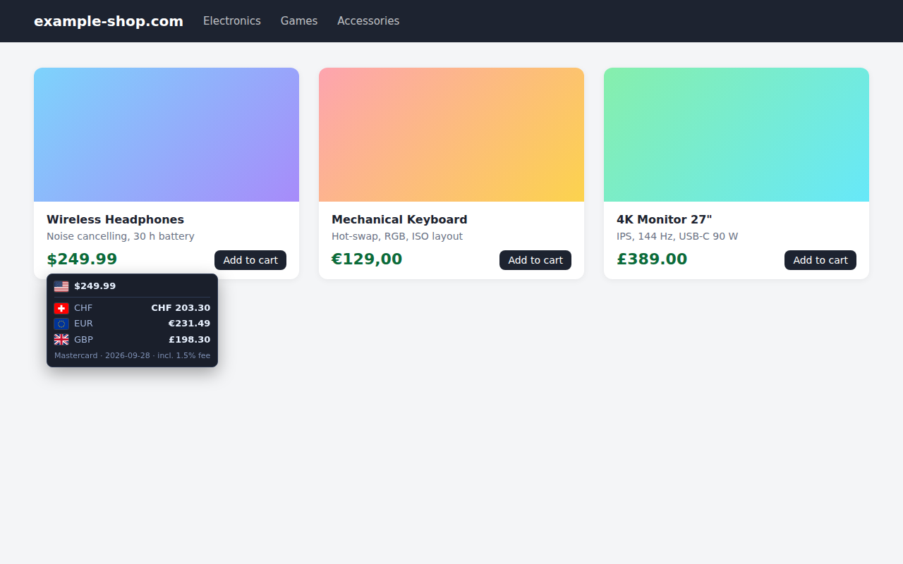

# Card Currency Converter

Chrome extension that shows prices on any website in your card currency, using the daily Mastercard exchange rate and your bank's foreign-currency fee.

## Installation

1. Download `card-currency-converter-vX.Y.Z.zip` from the [latest release](https://github.com/isikerkan/Neon-Currency/releases/latest) and extract it.
2. Open `chrome://extensions` in Chrome.
3. Enable **Developer mode** (toggle top right).
4. Click **Load unpacked** and select the extracted folder (the one containing `manifest.json`).
5. Pin the extension via the puzzle icon in the toolbar.

**Update:** extract the new release into the same folder and click the reload icon of the extension in `chrome://extensions`.

## Setup

Open the settings via right-click on the extension icon → **Options** (or the ⚙️ button in the popup).

| Setting | Description |
|---------|-------------|
| Main currency | Currency prices are converted into (default CHF). |
| Quick currency shortcuts | Additional currencies shown in the price tooltip and as buttons in the popup. |
| Preferred currencies for detection | Preferred when a selection contains several or ambiguous currency codes. |
| Bank fee (%) | Your card's foreign-currency fee, added to every converted amount. |
| Allow selecting conversion date | Enables a date field to convert with a historical rate. |
| Default rate date | Pre-filled historical date (only when the option above is enabled). |
| Show floating conversion when hovering a detected price | Turns the price tooltip on or off. |
| Use Mastercard page in background if the direct request is blocked | If Mastercard blocks the direct rate request, the rate is fetched via the Mastercard converter page in a minimized window. |
| Card currency | Pre-filled source currency in the popup. |

Click **Save Settings**.

## Usage

### Price tooltip

Move the mouse over a price on any website, e.g. `$19.99`, `€1.234,56`, `CHF 29.–` or `1 299,00 zł`. After a short moment a card shows:

- the detected price with its flag,
- the amount in your main and quick currencies, including the bank fee,
- the Mastercard rate date and the fee applied.

Hover a row to see the exchange rate. The card closes when you move away, scroll or press `Esc`.

`$`, `kr` and `¥` are resolved by the website's country (e.g. `$` on a `.ca` site → CAD).

### Right-click conversion

1. Select a price on a page.
2. Right-click → **Convert price to card currency**.
3. A small window shows rate, converted amount, fee and total. If the currency cannot be detected, enter amount and currency manually.

### Popup

1. Click the extension icon.
2. Enter amount and source currency.
3. Click one of your quick currency buttons. The last conversion is kept in the popup.

## Notes

- Rates come from Mastercard's public currency converter; no API key or account is needed. If today's rate is not published yet, the most recent one is used and its date is shown.
- Rates are cached for 30 minutes, so repeated conversions are instant.
- The first conversion may briefly open a minimized Mastercard window (see the *Use Mastercard page in background* setting).
- Privacy: only the currency pair and date are sent to Mastercard, never the amount or the page. Details in [PRIVACY.md](PRIVACY.md).
- Not affiliated with or endorsed by Mastercard.
